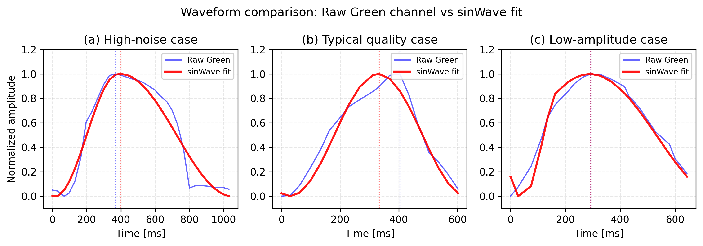

<!-- _class: title-slide -->

<!-- _footer: "" -->

<!-- _paginate: false -->

# Blood Pressure Estimation Based on Asymmetric Sine Wave Model Residuals Optimized for PPG in 30fps Visible Camera Environment

**Yusuke Nakazawa**$^{1\dagger}$, Kent Nagumo$^{1}$, Akio Nozawa$^{1}$

$^{1}$Department of Electrical and Electronic Engineering,
Graduate School of Science and Engineering, Aoyama Gakuin University

---

<!-- header: Introduction: The Goal -->

### Why Continuous ANS Monitoring?

- **Demand**: 3.4 billion people with neurological disorders [1].
- **Problem**: Autonomic dysfunction (e.g. Diabetic Neuropathy) [2].
- **Target**: Continuous monitoring via **smartphone  camera** [3].

[1] GBD 2021 Collaborators, Lancet Neurol., 2024
[2] Vinik et al., Diabetes Care, 2003
[3] Sun & Thakor, IEEE TBME, 2016

---

<!-- header: Introduction: The Limitation -->

### The 30fps Barrier

- **Constraint**: Consumer smartphones limit: **30 fps**.
- **Nyquist Limit (15 Hz)**:
  - Misses high-order harmonics [9].
- **Timing Resolution (~33 ms)**:
  - Peak error: $\pm16.5$ ms.
  - **Issue**: Morphological features (TTP) unreliable [5].
- **Noise**: Motion artifacts common [11, 12].

[5] Millasseau et al., J. Hypertension, 2006
[9] Alian & Shelley, Best Pract. Res. Clin. Anaesthesiol., 2014
[11] Verkruysse et al., Opt. Express, 2008
[12] McDuff et al., IEEE TBME, 2014

---

<!-- header: Introduction: The Problem -->

### RTBP Fails at 30fps

- **RTBP**: Relies on peaks/valleys [5].
- **High FPS**: Accurate [5, 7].
- **Low FPS (30fps)**:
  - Jitter causes high variance.
  - Feature-based regression fails.

[5] Millasseau et al., J. Hypertension, 2006
[7] Charlton et al., IEEE RBME, 2019

---

<!-- header: Introduction: The Solution -->

### Proposal: Asymmetric Sine Wave Model

- **Idea**: **Whole shape**, not points 
- **Method**: Fit smooth model to 30fps data.
- **Why?**:
  - **Robust**: Averages out noise.
  - **Efficient**: Only **4 parameters**.
  - **Stable**: No overfitting .

[13] Basso et al., Physiol. Meas., 2024
[14] Tiinanen et al., IEEE EMBC, 2017
[16] Hall & Hall, Guyton Textbook of Medical Physiology, 2020

---

<!-- header: Objective -->

### Research Objective

**Propose a parameter-light Asymmetric Sine Wave Model for stable 30fps estimation, using residuals (distortion) as a vascular stiffness indicator [6].**

[6] Nichols, Am. J. Hypertens., 2005

---

<!-- header: Method: Asymmetric Sine Wave Model -->

### Fitting to Noisy 30fps Data

$$
s(t) = \text{mean} + \frac{A}{2} \cdot \sin(\theta(t))
$$

- **Asymmetry**: Systolic ($T_{sys}$) vs Diastolic ($T_{dia}$) [16].
- **Concept**:
  - **Raw**: Noisy points.
  - **Model**: Smooth curve.

[16] Hall & Hall, Guyton Textbook of Medical Physiology, 2020

---

<!-- header: Method: Feature Extraction -->

### 1. Model Parameters (sinBP(M))

- Amplitude ($A$), Phase ($\Phi$), Mean.
- *Stable global features.*

### 2. Distortion Index (sinBP(D))

- **Residual ($E$)**: RMS error (Raw vs Model).
- **Physiology** [4, 6]:
  - Model = "Ideal" soft vessel.
  - **Residual** = **Stiffness / Reflection**.
  - $Stiffness_{sin} = E \sqrt{A}$

[4] Allen, Physiol. Meas., 2007
[6] Nichols, Am. J. Hypertens., 2005

---

<!-- header: Results: Waveform Evaluation -->

### Model as Noise Filter

- **MAPE**: Improved **11.5 pts** (29.7% $\to$ 18.2%).
- **Effect**: Extracts pulse shape from noise.

| Channel           |    MAPE [%]    |  RMSE [a.u.]  |
| :---------------- | :-------------: | :------------: |
| **sinWave** | **18.22** | **2.24** |
| Green (Raw)       |      29.71      |      3.64      |

---

<!-- header: Results: BP Estimation Accuracy -->

### Comparison with RTBP

- **sinBP(D)**: Best accuracy across all metrics.
- **MAPE/MAE**: Reduced error margins vs RTBP.
- **RMSE**: Significant drop (suppressed large errors).
- **Corr**: Improved tracking capability.
- Ridge regression ($\lambda = 1.0$) [15].

| Method             |     SBP MAE     |    SBP RMSE    |     DBP MAE     |    DBP RMSE    |
| :----------------- | :-------------: | :-------------: | :-------------: | :-------------: |
| RTBP               |      20.66      |      28.02      |      16.11      |      22.43      |
| sinBP(M)           |      19.47      |      24.70      |      15.20      |      19.73      |
| **sinBP(D)** | **18.98** | **24.17** | **14.84** | **19.31** |

*(Unit: mmHg)*

### Feature Contribution Analysis

- **Distortion ($E$)**: Large positive coefficient.
  - **Correction**: Adds BP for stiff vessels (high reflection).
- **Stiffness ($E\sqrt{A}$)**: Negative coefficient.
  - **Correction**: Prevents overestimation when amplitude ($A$) is large.`
`

[15] Mukkamala et al., IEEE TBME, 2015

---

<!-- header: Discussion: Why is sinBP(D) Best? -->

### 1. Hypothesis Confirmation
- **Result**: sinBP(M) & sinBP(D) > RTBP.
- **Reason**: 
  - RTBP relies on "points" (sensitive to 30fps jitter).
  - sinBP uses **whole-waveform fitting** (robust to noise).

### 2. Physiological Role of Features
- **Distortion ($E$)**: **Positive** coefficient.
  - Captures **vascular stiffness** & **reflection** (unmodeled components).
  - *Correction*: Adds BP for stiff vessels.
- **Stiffness ($E\sqrt{A}$)**: **Negative** coefficient.
  - Captures **amplitude-dependent stiffness**.
  - *Correction*: Prevents overestimation when amplitude ($A$) is large.

---

<!-- header: Conclusion -->

### Summary

1. **30fps Issue**: Feature methods fail [5].
2. **Solution**: Asymmetric Sine Model (robust, few params).
3. **Finding**: **Residual (Distortion)** represents vascular stiffness [6].
4. **Future**: Larger, diverse dataset.

[5] Millasseau et al., J. Hypertension, 2006
[6] Nichols, Am. J. Hypertens., 2005

---

<!-- header: Appendix / Backup Slides -->

### Backup Slides

- Q1: Sample Size Validity
- Q2: Frame Rate Choice
- Q3: RTBP Details
- Q4: Calibration

---

<!-- header: Q1: Sample Size (N=5) Validity -->

### Pilot Study Justification

- **Pilot Study**: Focus was on validating the *algorithm's stability* at 30fps.
- **Consistency**: All 5 subjects showed similar trends (Model > RTBP).
- **Future**: Large-scale data collection planned to verify generalizability across age/gender.

---

<!-- header: Q2: Why not 60fps or 120fps? -->

### Market & Accessibility

- **Market Reality**: The vast majority of front-facing cameras on current smartphones are locked to 30fps (or default to it).
- **Accessibility**: To enable "ubiquitous" monitoring, the algorithm *must* work at the lowest common denominator (30fps).
- **Performance**: At >60fps, RTBP performance would likely recover, but our goal is 30fps robustness.

---

<!-- header: Q3: RTBP Algorithm Details -->

### RTBP Vulnerability

- **Features Used** [5]:
  - Amplitude ($A$)
  - Heart Rate (HR)
  - Relative TTP (Time-to-Peak)
- **Vulnerability**: TTP calculation relies on the exact frame of the peak. A 1-frame shift (33ms) causes a massive % error in TTP, destabilizing the regression.

[5] Millasseau et al., J. Hypertension, 2006

---

<!-- header: Q4: Individual Calibration -->

### Calibration Strategy

- **Current Approach**: Individual models were created for this study to test feasibility.
- **General Model**: A universal model requires more data [10].
- **Calibration**: In practice, a one-time calibration with a cuff device would be used to offset the intercept (Mean BP) [15].

[10] Zhang et al., Proc. MLR, 2020
[15] Mukkamala et al., IEEE TBME, 2015

---

<!-- header: References -->

[1] GBD 2021 Nervous System Disorders Collaborators. "Global, regional, and national burden of disorders affecting the nervous system..." Lancet Neurol., 2024.
[2] Vinik et al. "Diabetic autonomic neuropathy." Diabetes Care, 2003.
[3] Sun & Thakor. "Photoplethysmography revisited..." IEEE TBME, 2016.
[4] Allen. "Photoplethysmography and its application..." Physiol. Meas., 2007.
[5] Millasseau et al. "Contour analysis of the PPG pulse..." J. Hypertension, 2006.
[6] Nichols. "Clinical measurement of arterial stiffness..." Am. J. Hypertens., 2005.
[7] Charlton et al. "Assessing model age from the PPG..." IEEE RBME, 2019.
[9] Alian & Shelley. "Photoplethysmography." Best Pract. Res. Clin. Anaesthesiol., 2014.
[10] Zhang et al. "Developing personalized models..." Proc. MLR, 2020.
[11] Verkruysse et al. "Remote plethysmographic imaging..." Opt. Express, 2008.
[12] McDuff et al. "Improvements in remote cardiopulmonary..." IEEE TBME, 2014.
[13] Basso et al. "A skewed-Gaussian model..." Physiol. Meas., 2024.
[14] Tiinanen et al. "Model selection for pulse decomposition..." IEEE EMBC, 2017.
[15] Mukkamala et al. "Toward ubiquitous BP monitoring via PTT..." IEEE TBME, 2015.
[16] Hall & Hall. Guyton and Hall Textbook of Medical Physiology. 14th ed., 2020.

